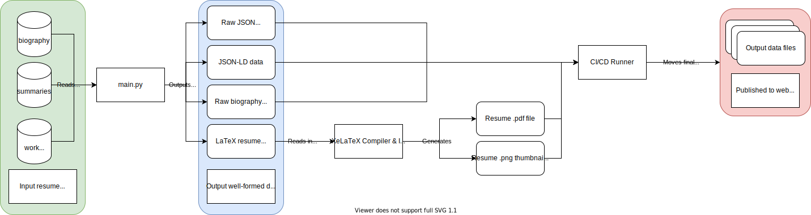

# Resume | Jason Yao
[](https://github.com/JasonYao/resume/actions/workflows/main.yml)

> Imagine what I could do if I wasn't doing this

The following respo contains all the code required in automatically
generating, distributing, and service-ifying my resume data.

## Link to Resume
To see the pdf version of this resume, please click the image below:
[
](https://www.jasonyao.com/resume/Resume_Jason_Yao.pdf)

## Resume Data API
I'm a big fan of data-driven architectures, so even my resume data is
in a machine and human readable form through the following commands below.

### JSON-LD Schema.org JSON Payload
* This data payload format is a [JSON-LD schema.org markup](https://jsonld.com/person/) for metadata 
     content data
* The data payload can be found [here](https://www.jasonyao.com/resume/json-schema.json), and
  can be accessed over curl with:

```sh
# The jq just adds in some pretty-formatting, feel free to omit if you don't want it
curl https://www.jasonyao.com/resume/json-schema.json | jq '.'
```

### JSON Data
* This data payload format is a more complete and human-readable version of the resume data
  in JSON form, without having any of the metadata annotations from the JSON-LD version
* The data payload can be found [here](https://www.jasonyao.com/resume/raw-data.json), and
  can be accessed over curl with:
```sh
# The jq just adds in some pretty-formatting, feel free to omit if you don't want it
curl https://www.jasonyao.com/resume/raw-data.json | jq '.'
```

### Raw Biography Data
* This is just a raw text file with the latest version of my linkedin bio
* The raw biography text can be found [here](https://www.jasonyao.com/resume/biography.txt), and
  can be accessed over curl with:

```sh
# The jq just adds in some pretty-formatting, feel free to omit if you don't want it
curl https://www.jasonyao.com/resume/biography.txt
```

## Pipeline Overview


1. We use Python 3 for pre-processing and templating of data
2. [LaTeX](https://www.latex-project.org), and in particular
   [Xe(La)TeX](http://xetex.sourceforge.net/) is used to
   actually generate the PDF version of the resume, which
   is used for its UTF-8 goodness and implicit access to
   system-wide fonts.

## Install (macOS)
```sh
# Installs pdf generation dependencies
brew cask install mactex

# Install the FontAwesome font by double clicking on it

# [OPTIONAL] Installs a good pdf viewer and IDE
brew cask install texmaker
```

## Usage
To generate the pdf from the command-line:
```sh
bin/build
# OR
xelatex Resume_Jason_Yao.tex
```

## Testing
To run the automated tests:
```sh
bin/test
# OR
pytest
```

## License
This repo is licensed under the terms of the MIT license,
a copy of which may be found [here](LICENSE)
